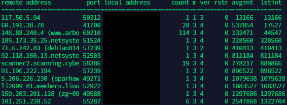
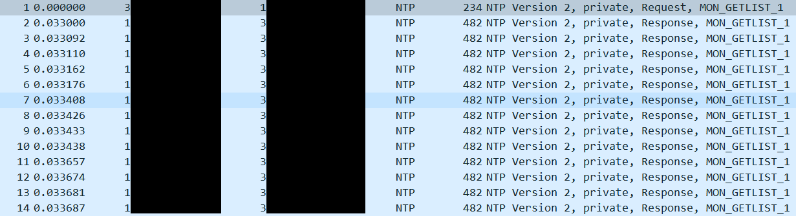
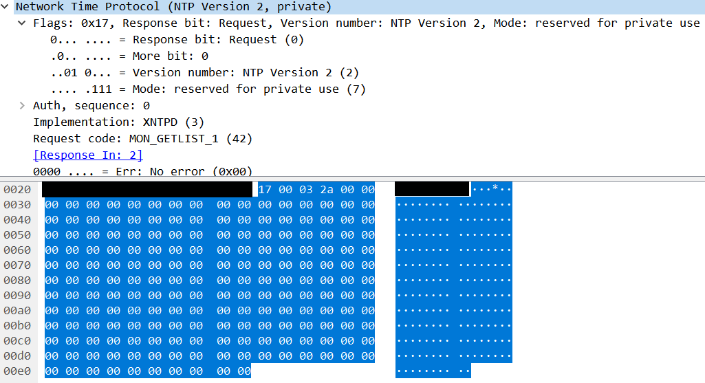
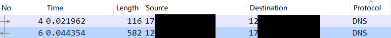
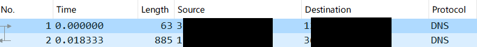
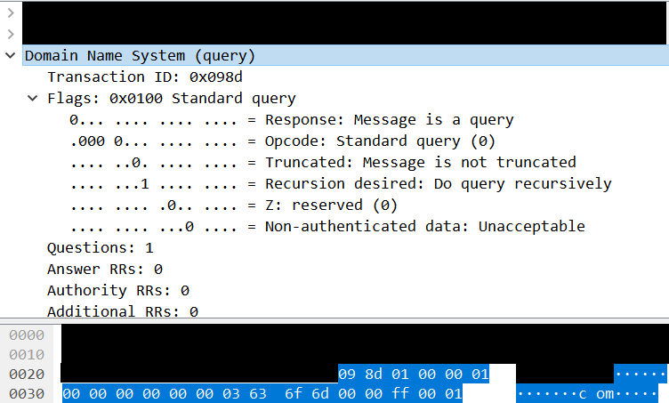
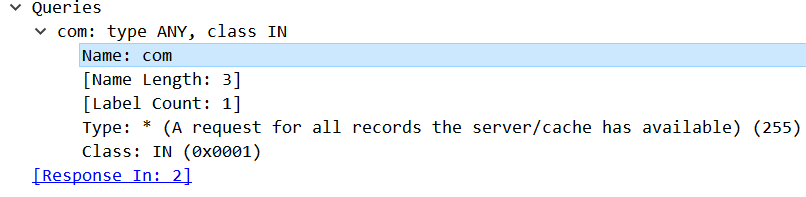

# 反射型DDOS(DRDOS)

>该文本主要是记录反射型攻击的原理，以及部分脚本思路，若有理解不对的地方，希望指出，谢谢！

## NTP

> 协议简介：NTP协议(Network Time Protocol)，是用来同步网络中各个计算机时间的协议。

> 利用原理：NTP协议中Monlist指令，可以向目标NTP服务器查询进行过同步的最新600个IP，从而达到了放大攻击的效果。

### 实验分析

- 首先找到一个有monlist服务的IP，在linux下使用`ntpdc -c monlist ip_address`进行查询， 得到返回结果如下：  
  
同时用`tcpdump udp port 123 -w ntp.pcap`保存所有端口为123的包，放入wireshark中进行进一步分析，部分截图如下：  
  
返回的请求包数量由目标服务器上存储的数量决定，有些NTP服务器的返回可能只有1个IP，那么放大倍数可能只有两倍左右了。图中的IP返回了大量的包，放大了数百倍。

- 首先本机IP向目标IP发送了一个包长为234的monlist查询，其具体报文如下所示：

其中协议的简单分析如下：  
Flags(0x17):
bit(1):Request位，0代表请求，1代表答应  
bit(2):是否闰秒等  
bit(3-5):NTP版本，version 2  
bit(6-8):0(保留)，1(主动对等体模式)，2(被动对等体模式)，3(客户模式)，4(服务器模式)，5(广播模式)，6(NTP控制报文)，7(内部使用预留)  
 Auth,sequence(0x00)：  
认证相关（没有查到详细资料，望补充）  
 Implementation(0x03):  
(没有查到详细资料)  
 Request_code(0x2a):  
请求类型monlist  
 观察到NTP的请求报文为 `17 00 03 2a (00)*188`，有些搜索到的脚本填充00仅为4个，在利用和检测的时候是不行的。

### 自动化思路

>在metasploit的检测脚本中，检测使用的payload语句为  
`@probe = Rex::Proto::NTP.ntp_private(datastore['VERSION'], datastore['IMPLEMENTATION'], 42, "\0" * 40).to_binary_s`  
即使用40个00即可完成检测。需要构造的就是原生UDP包，并将data字段填充为上述请求报文。

- 利用IP筛选
  - 条件：筛选出返回包数大的IP，且目标服务器带宽好，处理快。否则会出现向目标IP下发包，却没有回包，或者基本没有放大的情况。
  - 大量IP的检测：思路1：开启一个UDP监听端口，在一定时间内计算单个IP来源的返回包的个数，个数越多，放大倍数越大。思路2：
  - 少量IP的检测：简单快速的筛选可以使用metasploit里的`auxiliary/scanner/ntp/ntp_monlist`模块进行检测，用metasploit的RPC接口其实也能实现一些简单的自动化。
- 发包利用
  - 验证型的发包可以用python的scapy构包，或者构造原生UDP发包。
  - 利用型的发包最好使用C\C++等高性能的语言，我使用了Golang，因为其性能相对于python较好且开发速度较快（之后可能会用C\C++重写吧！）

- 检测的server端脚本
  - [Server端demo脚本](https://github.com/chriskaliX/DDOS/blob/master/Drdos-note/script/discover/server.py)

### 参考

- 检测参考：
  - [Nmap : ntp-monlist.nse](https://svn.nmap.org/nmap/scripts/ntp-monlist.nse)
  - [Metasploit : ntp_monlist.rb](https://github.com/rapid7/metasploit-framework/blob/master/modules/auxiliary/scanner/ntp/ntp_monlist.rb)
- 其他文章
  - [NTP攻击反射复现](https://www.freebuf.com/articles/network/129288.html)

## DNS

> 协议简介：它作为将域名和IP地址相互映射的一个分布式数据库，能够使人更方便地访问互联网。

> 利用原理：通过伪造IP源，对DNS服务器进行查询，返回较大的数据包从而达到放大攻击的效果

### 实验分析

- 找到一个DNS服务器，使用 `tcpdump host xx.xx.xx.xx -w dns.pcap` 抓取特定IP的DNS数据包。在linux上输入`dig any isc.org @xx.xx.xx.xx` 截图如下：

图中的放大倍数较小，这与目标IP本身存在一定关系

- 查询了dig服务默认是使用udp的，但是本次的都是TCP流量包。于是用metasploit中的检测模块重新抓包一次，截图如下：

放大倍数在14倍左右。

- 具体的报文如下所示：

其中有：
 QR(1bit)：0为查询报文，1为响应报文
 Opcode(4bits)：0为标准查询，1为反向查询，2为服务器状态请求
 AA(1bit)：授权回答（包里没有）
 Truncated(1bit)：可截断，设为1代表返回超过512时只返回前512
 Recuried(1bit)：1为递归查询
 RA(1bit)：可用递归
 Rcode(4bits)：返回码，0代表没有错误
 
 Questions：查询问题区域节的数量
 Answers RRs：回答区域的数量
 Authoritative RRs：授权区域数目
 Additional RRs：附加区域的数量
 
 **正文部分**

这里请求的是`com`，`metasploit中自带是的isc.org`。其中报文中0x03,0x63,0x6f,0x6d,0x00。0x03代表长度是3，0x63,0x6f,0x6d代表com，0x00为终止符。
 \x00\xff代表查询的是ANY，最后的\x00\x01，对于Internet查询类，总是IN

### 自动化思路

> 在metasploit中检测的关键字为`@msearch_probe = "\x09\x8d\x01\x00\x00\x01\x00\x00\x00\x00\x00\x00" + targdomainpacket + "\x00\x00" + querypacket + "\x00\x01"
  end`，其中targetdomainpacket是查询的域名，querypacket是查询的类型。

> 可固定payload为：
`"\x09\x8d\x01\x00\x00\x01\x00\x00\x00\x00\x00\x00\x03\x63\0x6f\x6d\x00\x00\xff\x00\x01"`

- 筛选与利用：
  - 思路同样，填充至UDP包的data字段，使用脚本或者metasploit下`/auxiliary/scanner/dns/dns_amp`进行快速的校验或者简单的自动化
  - 想要更高的效果，提高代码中对length判断的值

- 检测server端脚本
  - [Server端demo脚本](https://github.com/chriskaliX/DDOS/blob/master/Drdos-note/script/discover/server.py)

### 参考

- [DNS协议](https://wenku.baidu.com/view/94004323dcccda38376baf1ffc4ffe473368fd36.html)
- [Metasploit检测脚本](https://github.com/rapid7/metasploit-framework/blob/master/modules/auxiliary/scanner/dns/dns_amp.rb)
